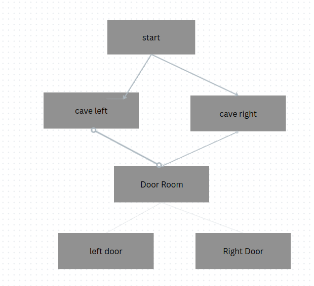

# Chose your own adventure game. 

## Summary : 
Some random elements included to increase complexity
and fun. The game will start by asking the player for their name and the using if else statements to send them through
a series of caves or doors as shown below. A random number generator will be used to a change which door is safe or not 
with each pass. Using this method a object could be added for each choice allowing for endless possible results.

This project could be expanded on to include player health on other dynamics to make it more of a txt based RPG. However
this is not what I was looking for with this project though I do plan to do a txt based RPG in the future.

