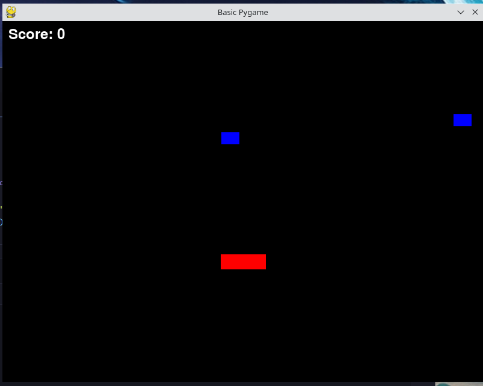

# Basic game written in pygame

Game is a dodger type game using pygames. This is being separated in to classes and having additional directories and 
files. First challenge was to get things moving. Which was an issues due to me having the update functional def start at 
the wrong point. With this corrected I forgot to reset the screen color after the object moved creating the below image. 

Managing to get a score block added was more difficult than expected. likely would have been simpler if 
I had used a single file instead of going for the class system and multiple files. At some point will need to make a 
util directory and move score system there. 

## Task needing completion :

1. Add timer
2. Add pause before game starts and after loss
3. Add score board.
4. Extract game logic in to functions for cleaner code. 