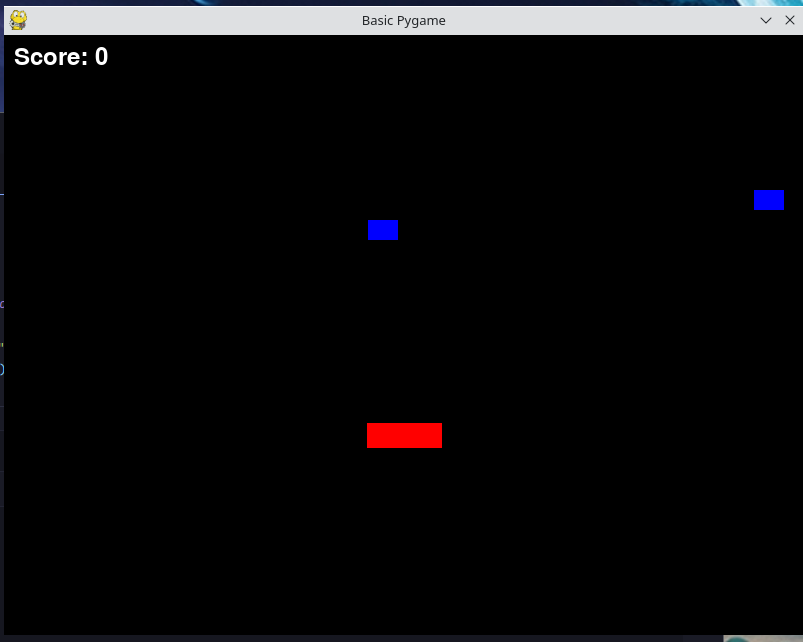
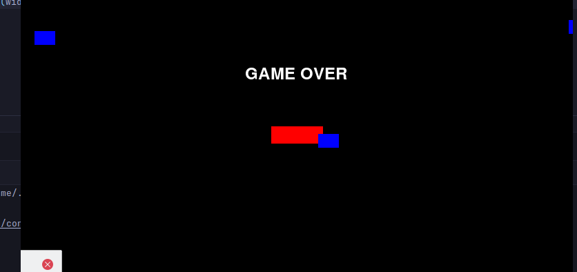

# Basic game written in pygame

Game is a dodger type game using pygames. This is being separated in to classes and having additional directories and 
files. The First challenge was to get things moving. Which was an issue due to me having the update functional def start at 
the wrong point. With this corrected, I forgot to reset the screen color after the object moved creating the below image. 

Managing to get a score block added was more challenging than expected.
Likely would have been simpler if 
I had used a single file instead of going for the class system and multiple files.
At some point, we will need to make a 
util directory and move score system there. 

Adding of game over screen with 10-second delay was simple in comparison to score block.

## Task needing completion :

1. Add timer - done
2. Game over screen. — done
3. Add score board. — done
4. Extract game logic in to functions for cleaner code. — done

### Things for a future version :

The game loop is overall the crowed, and to create a proper intro would require a redesign of the whole loop.
So this has been held off till more advanced games, as this game has already become more advanced than original planned.