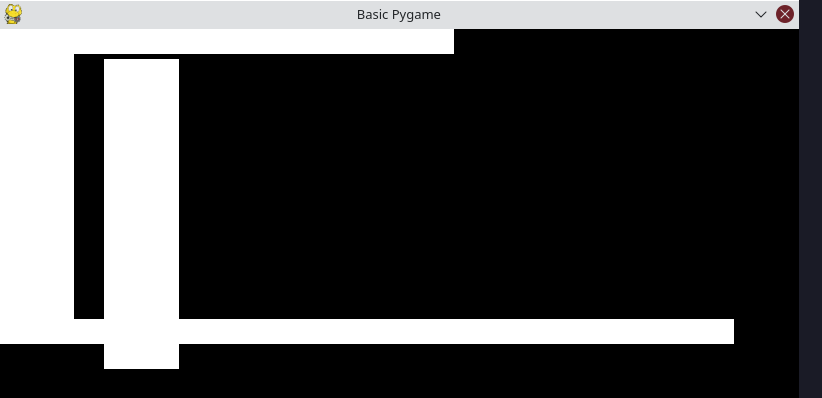

# Basic game written in pygame

Game is a dodger type game using pygames. This is being separated in to classes and having additional directories and 
files. First challenge was to get things moving. Which was an issues due to me having the update functional def start at 
the wrong point. With this corrected I forgot to reset the screen color after the object moved creating the below image. 

