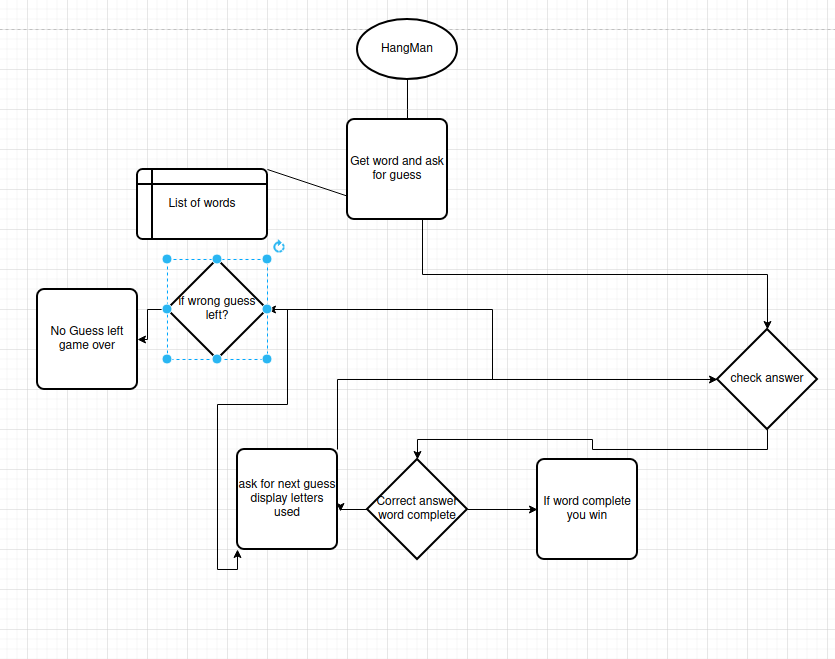

# Hangman :
In this project, I want to use multiple directory to separate out functions. I am also planning to
use a CSV file to load the word list. This will also be the first time I attempt the use of ASCII art.
I plan to start with a static list of words. One of these words will then be chosen at random from there, the user will
be asked to guess a letter. After I will add tracking of success or failure and ASCII art. Once these steps are complete
I will replace the static list with the CSV file.

## User Stories :

1. As a user, I want to be able to choose to enter a guess.
2. as a user, I want to know if my answer was correct.
3. as a user I want to know, my letter guess fell in relation to the actual work.
4. as a user, I want to have a visual progression of my failed guesses.

## Flow Chart

## Goals

| Item Nam                          | Status | Comment                                                                          |
|-----------------------------------|--------|----------------------------------------------------------------------------------|
| Flow chart design                 | done   | draw.io                                                                          |
| create list and guessing function | done   |                                                                                  |
| create tracker                    | done   |                                                                                  |
| create ASCII art                  | done   | [ACII art](https://gist.github.com/chrishorton/8510732aa9a80a03c829b09f12e20d9c) |
| replace list with txt file        | done   |                                                                                  |
| create unit tests                 |        |                                                                                  |

## Tech Used :

| Tech name | Usage |
|-----------|-------|
